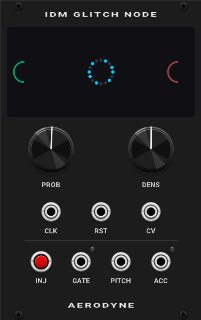

# Aerodyne

**Aerodyne** is a premium plugin for VCV Rack 2, focusing on industrial design aesthetics and complex, unpredictable modulations.

The **IDM Glitch Node** is the flagship module of the Aerodyne series. It is a shift-register based CV and Gate generator designed specifically for Intelligent Dance Music (IDM) production, glitchy rhythms, and generative patching.

## Overview

Unlike standard random generators or LFOs, the IDM Glitch Node utilizes a shift-register mechanism that "remembers" recent inputs and loops them, while constantly injecting probabilistic mutations. This allows you to create patterns that are repeating enough to be musical, yet constantly evolving.

## Features & Controls

* **PROB (Probability):** Determines the chance of a mutation occurring on each clock step. Keep it low for stable looping patterns, or turn it up for total chaos.
* **DENS (Density):** Controls the intensity and value range of the injected glitch data.
* **INJECT Button (Manual):** A massive, tactile push button to manually inject random data into the shift register.
* **INJECT CV Input:** Allows external modulation or triggers to force data injection.
* **CLK (Clock) Input:** Drives the shift register. Feed it a steady clock or irregular triggers.
* **DATA Input:** The source CV to be sampled and shifted.
* **OUT (CV Output):** The main bipolar CV output from the shift register.
* **GATE Output:** Outputs a trigger/gate whenever a mutation or manual injection occurs, perfect for firing envelopes or drum modules.

## Design Aesthetic

The Aerodyne modules are built with a "flat, wide, and heavy" industrial design philosophy.
* High-contrast dark mode panel.
* Custom, widened `Roboto-Bold` typography for a cinematic, hardware-like feel.
* Extra-large tactile knobs and an oversized push button for satisfying interaction.
* Dynamic OLED-style data display screen reflecting the current mutation states.

## Installation

1. Open VCV Rack 2.
2. Go to **Library -> Update all**.
3. Search for **Aerodyne** and add the module to your patch.

## License
This project is licensed under the GPL-3.0 License. See the `LICENSE.txt` file for details.
